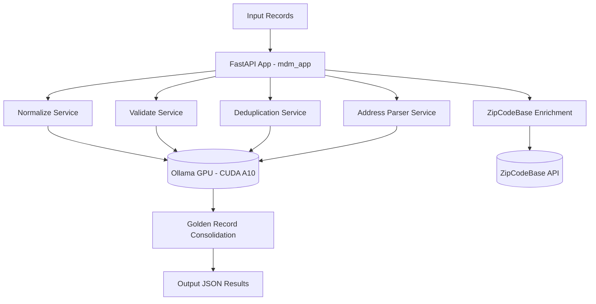

# Master Data Management (MDM) Project Deployment Guide

## 1. Introduction

Modern organizations face enormous challenges in managing and maintaining the quality of their data. As businesses grow, data becomes fragmented across multiple systems such as ERPs, CRMs, e-commerce platforms, supplier management systems, and financial applications. This fragmentation creates duplicated records, inconsistent formats, incomplete information, and difficulty in ensuring compliance with regulations such as GDPR or LGPD.

Master Data Management (MDM) is the discipline designed to address these challenges. MDM provides a structured way to:

- 	Unify and normalize customer, product, supplier, and financial data across multiple sources.
- 	Eliminate duplicates and identify the “golden record” that represents the single source of truth.
- 	Validate and harmonize business rules, codes, and formats to ensure data is consistent and reliable.
- 	Enable integration across business units, ensuring that every system consumes the same trusted master data.

In daily operations, MDM simplifies tasks such as ensuring invoices match customer records, avoiding shipment errors caused by incorrect addresses, and accelerating onboarding of new suppliers or customers by relying on pre-validated, harmonized data.

⸻

### AI-Driven MDM with Large Language Models

Traditionally, implementing MDM required complex business rules, hardcoded validations, and long configuration cycles. Today, AI and Large Language Models (LLMs) introduce a modern approach that simplifies and accelerates these processes. With LLMs, it is possible to:
-	Understand unstructured inputs such as free-text addresses, descriptions, or inconsistent product names.
-	Automatically normalize formats (e.g., postal codes, phone numbers, CPF/CNPJ) without needing thousands of rules.
-	Enrich missing data by combining internal records with external APIs (postal lookup, product codification, etc.).
-	Accelerate configuration by reducing manual work in defining and tuning deduplication rules.
-	Provide explainability and adaptability, since AI-driven prompts can be adapted quickly to new countries, business domains, or regulations.

This AI-enhanced MDM approach transforms what was once a rigid and slow data management process into a flexible, intelligent, and scalable solution.

⸻

### Technologies

This tutorial demonstrates how to implement an AI-powered MDM system using:
-	Python (FastAPI + AsyncIO): for building modular and distributed services.
-	Ollama with CUDA GPUs: to run open-source LLMs locally with high performance, leveraging NVidia GPU acceleration.
-	Oracle Cloud Infrastructure (OCI): providing powerful and cost-effective GPU instances, such as A10 GPU shapes, ideal for AI workloads.
-	ZipcodeBase API (external enrichment): for address validation and enrichment.
-	MDM Services (Normalize, Validate, Deduplicate, Address Parse): modularized into microservices for performance and scalability.

⸻

### Why Oracle Cloud Infrastructure GPUs?

OCI offers GPU shapes specifically designed for AI and data science workloads. The A10 GPU instances provide the right balance of power and cost for running models like LLaMA or Qwen efficiently. Benefits include:
-	Scalability: deploy as many GPUs as needed for your workload.
-	Performance: optimized for CUDA workloads, ensuring high throughput for LLM inference.
-	Cost efficiency: pay only for the capacity you use, scaling dynamically as projects grow.
-	Enterprise integration: seamless connectivity with Oracle Autonomous Database, Object Storage, API Gateway, and other OCI services.

By combining MDM best practices with AI-driven automation and OCI’s GPU infrastructure, organizations can dramatically reduce the time, cost, and complexity of deploying a robust Master Data Management solution.

## 2. Objectives

This project implements a **Master Data Management (MDM) pipeline** powered by **AI agents** and **GPU acceleration**.  
Its purpose is to **normalize, validate, deduplicate, harmonize, and enrich master records** across multiple domains, such as:

- **Customer records** (names, phone numbers, emails, addresses, etc.)  
- **Product data** (SKU, EAN, units, volumes, etc.)  
- **Supplier information** (legal entities, CNPJs, contact data)  
- **Financial data** (transaction codes, normalization rules)  
- **Address standardization** (postal codes, neighborhoods, city/state consistency)

### Example Use Cases
- Consolidating duplicated **customer profiles** coming from multiple systems (CRM, ERP, Mobile App).  
- **Normalizing Brazilian addresses** with CEP validation via **ZipCodeBase API**.  
- Formatting **CPF, CNPJ, and phone numbers** into consistent formats.  
- Enriching records with **external data sources** (postal APIs, product catalogs).  

### Infrastructure
This deployment is designed for **NVIDIA A10 GPU instances** on **Oracle Cloud Infrastructure (OCI)**.  
OCI provides **specialized GPU compute shapes** that are CUDA-enabled, allowing high performance for **large language models (LLMs)** and **parallel inference workloads**.  

The system leverages **CUDA acceleration** to maximize throughput and process large amounts of records efficiently, distributing the workload across multiple GPU endpoints.

---

## 3. Prerequisites

### Hardware
- **GPU**: NVIDIA A10 or higher (OCI `VM.GPU.A10.1` or `BM.GPU.A10.4`).  
- **vCPUs**: Minimum 16 cores.  
- **RAM**: Minimum 64 GB.  
- **Disk**: At least 200 GB SSD (recommended NVMe).  

### Software
- **Operating System**: Oracle Linux 8 or Ubuntu 22.04.  
- **CUDA Toolkit**: Version 12.2+ with NVIDIA drivers installed.  
- **Python**: Version 3.10 or higher.  
- **Ollama**: Serving local LLMs in GGUF format.  
- **Conda Environment**:
  ```bash
  conda create -n mdm python=3.10 -y
  conda activate mdm
  pip install -r requirements.txt
  ```

### Required Python Packages
- `fastapi`  
- `uvicorn`  
- `httpx`  
- `pydantic`  
- `orjson`  
- `rake-nltk`  
- `regex`  
- `numpy`  

>**Note:** Don't worry about the Python packages. The application starter will install the packages in the first execution.

### External Services
- **ZipCodeBase API key** for address enrichment. The project will use this API Service free. You need to sign for the free account and get a Token Access.
- Access to **OCI tenancy** with GPU compute shapes enabled.  

---

## 4. Understand the Architecture

The project follows a **modular architecture** with clear separation of responsibilities.  



### Module Responsibilities
- **FastAPI App**: Orchestrates API requests and workflows.  
- **Normalize Service**: Uses LLM to reformat CPF, CNPJ, phone, and names.  
- **Validate Service**: Ensures compliance with domain-specific rules.  
- **Deduplication Service**: Detects and merges duplicate records.  
- **Address Parser Service**: Extracts structured components (street, city, neighborhood, state).  
- **ZipCodeBase Enrichment**: Complements address data with official postal information.  
- **Golden Record Consolidation**: Produces a unified, conflict-free record.  

---

## 5. Deploy the Application

You can download the source-code here: [mdm_project.zip](./files/mdm_project.zip) 

### Ollama on OCI A10 — Two-GPU Installation & Configuration (Step-by-Step)

This section explains how to install **Ollama** on an Oracle Linux VM with **two NVIDIA A10 GPUs**, run **one Ollama service per GPU** via `systemd`, pull and tune the **Qwen 2.5 7B** model, and configure your app (`config.py` and `run.sh`) to use both endpoints concurrently.

### Preconditions
- OCI VM with 2× NVIDIA A10 GPUs, NVIDIA drivers/CUDA installed (`nvidia-smi` works).
- Sudo access (e.g., user `opc`).

### Install Ollama

```bash
sudo dnf install -y curl
curl -fsSL https://ollama.com/install.sh | sh
# Disable default single service (we'll use two custom units)
sudo systemctl disable --now ollama || true
mkdir -p /home/opc/.ollama/models && sudo chown -R opc:opc /home/opc/.ollama
```

### Create systemd services (one per GPU)
Create `/etc/systemd/system/ollama-gpu0.service`:
```ini
[Unit]
Description=Ollama on GPU0 (A10 #0)
After=network.target

[Service]
User=opc
Group=opc
Environment=OLLAMA_MODELS=/home/opc/.ollama/models
Environment=CUDA_VISIBLE_DEVICES=0
Environment=OLLAMA_HOST=127.0.0.1:11434
Environment=OLLAMA_NUM_PARALLEL=4
Environment=OLLAMA_KEEP_ALIVE=5m
Environment=OLLAMA_DEBUG=INFO
ExecStart=/usr/local/bin/ollama serve
Restart=always
RestartSec=2s
LimitNOFILE=65535

[Install]
WantedBy=multi-user.target
```

Create `/etc/systemd/system/ollama-gpu1.service`:
```ini
[Unit]
Description=Ollama on GPU1 (A10 #1)
After=network.target

[Service]
User=opc
Group=opc
Environment=OLLAMA_MODELS=/home/opc/.ollama/models
Environment=CUDA_VISIBLE_DEVICES=1
Environment=OLLAMA_HOST=127.0.0.1:11435
Environment=OLLAMA_NUM_PARALLEL=4
Environment=OLLAMA_KEEP_ALIVE=5m
Environment=OLLAMA_DEBUG=INFO
ExecStart=/usr/local/bin/ollama serve
Restart=always
RestartSec=2s
LimitNOFILE=65535

[Install]
WantedBy=multi-user.target
```

Enable & tail logs:
```bash
sudo systemctl daemon-reload
sudo systemctl enable --now ollama-gpu0 ollama-gpu1
journalctl -u ollama-gpu0 -f &
journalctl -u ollama-gpu1 -f &
```

### Pull Qwen model
```bash
ollama pull qwen2.5:7b
```

### Configure your app (files included in this zip)
- `config.py` — endpoints, options, round-robin helper.
- `run.sh` — waits for endpoints, warms model, starts FastAPI app.

Make script executable:
```bash
chmod +x run.sh
```

### Quick test
```bash
# Check both endpoints
curl -s http://127.0.0.1:11434/api/tags | head
curl -s http://127.0.0.1:11435/api/tags | head

# Warmup via run.sh
./run.sh &
```

### Troubleshooting
- 404 on 11435 → confirm service is running and `OLLAMA_HOST` has no http:// prefix.
- One GPU idle → ensure app uses both endpoints (see `config.py`).
- OOM/slow → reduce `NUM_BATCH` or `NUM_CTX` and retry.


---

## 6. Test

### Send a Test Request
```bash
curl -X POST http://localhost:8080/mdm/process   -H "Content-Type: application/json"   -d '{
  "domain": "customer",
  "operations": ["normalize", "validate", "mask", "consolidate", "dedupe"],
  "policies": { "golden_record_priority": true },
  "records": [
    {
      "source": "APP",
      "id": "u-778",
      "name": "ana paula",
      "cpf": "98765432100",
      "email": "ana.paula+teste@dominio.com",
      "phone": "(21) 988887777",
      "cep": "22041001",
      "address": "Rua Figueiredo Magalhães, 123",
      "country_code": "BR"
    },
    {
      "source": "APP",
      "id": "u778",
      "name": "ana paula Silva",
      "cpf": "98765432100",
      "email": "ana.paula.teste@dominio.com",
      "phone": "(21) 98888-7777",
      "cep": "22041001",
      "address": "Rua Figueiredo Magalhães, 123 - Bairro Cristal",
      "country_code": "BR"
    },
    {
      "source": "CRM",
      "id": "cust-1001",
      "name": "Ana P. Silva",
      "cpf": "98765432100",
      "email": "anapaula@dominio.com",
      "phone": "21988887777",
      "cep": "22041-001",
      "address": "R. Figueiredo Magalhaes, 123",
      "locality": "Rio de Janeiro",
      "admin_area": "Rio de Janeiro",
      "country_code": "BR"
    },
    {
      "source": "ERP",
      "id": "C-778",
      "name": "Ana Paula da Silva",
      "cpf": "987.654.321-00",
      "email": "ana.silva@dominio.com",
      "phone": "021988887777",
      "cep": "22041-001",
      "address": "Rua Figueiredo Magalhães 123 Copacabana",
      "country_code": "BR"
    },
    {
      "source": "POS",
      "id": "pos778",
      "name": "Ana Paula S.",
      "cpf": "98765432100",
      "email": "ana.p@dominio.com",
      "phone": "98888-7777",
      "cep": "22041-001",
      "address": "Rua Figueiredo Magalhães, nº123",
      "country_code": "BR"
    },
    {
      "source": "WEB",
      "id": "user778",
      "name": "Ana Paula",
      "cpf": "98765432100",
      "email": "ana.paula.silva@dominio.com",
      "phone": "+55 (21) 98888-7777",
      "cep": "22041001",
      "address": "Av. Figueiredo Magalhães, 123",
      "country_code": "BR"
    },
    {
      "source": "LOYALTY",
      "id": "L778",
      "name": "Paula, Ana",
      "cpf": "98765432100",
      "email": "ana.paula@dominio.com",
      "phone": "21 98888 7777",
      "cep": "22041-001",
      "address": "Rua Figueiredo Magalhães, 123 Ap 301",
      "locality": "Rio de Janeiro",
      "admin_area": "Rio de Janeiro",
      "country_code": "BR"
    },
    {
      "source": "MARKETING",
      "id": "mk-778",
      "name": "ANA PAULA",
      "cpf": "98765432100",
      "email": "ana.paulasilva@dominio.com",
      "phone": "21988887777",
      "cep": "22041001",
      "address": "R Figueiredo Magalhaes 123",
      "country_code": "BR"
    },
    {
      "source": "SUPPORT",
      "id": "sup-778",
      "name": "A. P. Silva",
      "cpf": "98765432100",
      "email": "a.silva@dominio.com",
      "phone": "98888 7777",
      "cep": "22041-001",
      "address": "Rua Figueiredo Magalhães, nº 123",
      "country_code": "BR"
    },
    {
      "source": "APP",
      "id": "u-779",
      "name": "Ana Paula S",
      "cpf": "98765432100",
      "email": "ana.silva+promo@dominio.com",
      "phone": "(21)98888-7777",
      "cep": "22041001",
      "address": "Rua Figueiredo Magalhães,123",
      "country_code": "BR"
    },
    {
      "source": "ERP",
      "id": "C-778b",
      "name": "Ana P Silva",
      "cpf": "98765432100",
      "email": "ana.silva_test@dominio.com",
      "phone": "988887777",
      "cep": "22041-001",
      "address": "R Figueiredo Magalhães 123 Bloco A",
      "country_code": "BR"
    },
    {
      "source": "WEB",
      "id": "web778",
      "name": "Ana Paula",
      "cpf": "98765432100",
      "email": "anap@dominio.com",
      "phone": "55 21 98888-7777",
      "cep": "22041001",
      "address": "Rua Figueiredo Magalhaes 123",
      "locality": "Rio de Janeiro",
      "admin_area": "Rio de Janeiro",
      "country_code": "BR"
    },
    {
      "source": "CRM",
      "id": "cust-1002",
      "name": "Ana Paula S",
      "cpf": "98765432100",
      "email": "ana.silva.crm@dominio.com",
      "phone": "2198888-7777",
      "cep": "22041-001",
      "address": "R Figueiredo Magalhães, 123, Copacabana",
      "country_code": "BR"
    },
    {
      "source": "POS",
      "id": "pos-779",
      "name": "Ana P",
      "cpf": "98765432100",
      "email": "ap.silva@dominio.com",
      "phone": "98888-7777",
      "cep": "22041-001",
      "address": "Rua Figueiredo Magalhães 123",
      "locality": "Rio de Janeiro",
      "admin_area": "Rio de Janeiro",
      "country_code": "BR"
    },
    {
      "source": "LOYALTY",
      "id": "L779",
      "name": "Ana Paula",
      "cpf": "98765432100",
      "email": "ana.paula_loyalty@dominio.com",
      "phone": "(21)98888-7777",
      "cep": "22041001",
      "address": "Rua Figueiredo Magalhães, 123, ap 502",
      "country_code": "BR"
    },
    {
      "source": "MARKETING",
      "id": "mk-779",
      "name": "Ana Paula",
      "cpf": "98765432100",
      "email": "ana.silva+marketing@dominio.com",
      "phone": "21988887777",
      "cep": "22041-001",
      "address": "R. Figueiredo Magalhães, 123",
      "country_code": "BR"
    },
    {
      "source": "SUPPORT",
      "id": "sup-779",
      "name": "Ana Silva",
      "cpf": "98765432100",
      "email": "ana.suporte@dominio.com",
      "phone": "+55 21 98888-7777",
      "cep": "22041001",
      "address": "Rua Figueiredo Magalhães,123",
      "locality": "Rio de Janeiro",
      "admin_area": "Rio de Janeiro",
      "country_code": "BR"
    },
    {
      "source": "ERP",
      "id": "C-780",
      "name": "Ana P da Silva",
      "cpf": "98765432100",
      "email": "ana.official@dominio.com",
      "phone": "021988887777",
      "cep": "22041-001",
      "address": "Rua Figueiredo Magalhães, 123 - Copacabana",
      "country_code": "BR"
    },
    {
      "source": "WEB",
      "id": "user-780",
      "name": "Ana Paula",
      "cpf": "98765432100",
      "email": "ana.paula.web@dominio.com",
      "phone": "(21)988887777",
      "cep": "22041001",
      "address": "R Figueiredo Magalhães, 123",
      "country_code": "BR"
    }
  ]
}'
```

### Expected Output
- **CPF** formatted as `987.654.321-00`.  
- **Phone** formatted as `+55 21 98888-7777`.  
- **CEP** formatted as `22041-001`.  
- **Address enriched** with neighborhood `Copacabana`, city `Rio de Janeiro`, state `RJ`.  
- **Golden record** returned with deduplication applied.  

```json
{
    "record_clean": [
        {
            "source": "APP",
            "id": "u-778",
            "name": "Ana Paula",
            "cpf": "987.654.321-00",
            "cnpj": null,
            "email": "ana.paula+teste@dominio.com",
            "phone": "+5521988887777",
            "cep": "22041-001",
            "address": "Rua Figueiredo Magalhães, 123",
            "birth_date": null,
            "city": "Copacabana",
            "state": "RJ",
            "country_code": "BR",
            "_parsed": {
                "thoroughfare": "Rua Figueiredo Magalhães",
                "house_number": "123",
                "neighborhood": "Copacabana",
                "city": null,
                "state": "RJ",
                "postal_code": "22041-001",
                "country_code": "BR",
                "complement": null
            }
        },
        {
            "source": "APP",
            "id": "u778",
            "name": "Ana Paula Silva",
            "cpf": "987.654.321-00",
            "cnpj": null,
            "email": "ana.paula.teste@dominio.com",
            "phone": "+5521988887777",
            "cep": "22041-001",
            "address": "Rua Figueiredo Magalhães, 123 - Bairro Cristal",
            "birth_date": null,
            "city": "Copacabana",
            "state": "RJ",
            "country_code": "BR",
            "_parsed": {
                "thoroughfare": "Rua Figueiredo Magalhães",
                "house_number": "123",
                "neighborhood": "Cristal",
                "city": "Rio de Janeiro",
                "state": "RJ",
                "postal_code": "22041-001",
                "country_code": "BR",
                "complement": null
            }
        },
        {
            "source": "CRM",
            "id": "cust-1001",
            "name": "Ana P. Silva",
            "cpf": "987.654.321-00",
            "cnpj": null,
            "email": "anapaula@dominio.com",
            "phone": "+5521988887777",
            "cep": "22041-001",
            "address": "R. Figueiredo Magalhaes, 123",
            "birth_date": null,
            "city": "Copacabana",
            "state": "RJ",
            "country_code": "BR",
            "_parsed": {
                "thoroughfare": "Rua Figueiredo Magalhães",
                "house_number": "123",
                "neighborhood": "Copacabana",
                "city": null,
                "state": "RJ",
                "postal_code": "22041-001",
                "country_code": "BR",
                "complement": null
            }
        },
        {
            "source": "ERP",
            "id": "C-778",
            "name": "Ana Paula da Silva",
            "cpf": "987.654.321-00",
            "cnpj": null,
            "email": "ana.silva@dominio.com",
            "phone": "+5521988887777",
            "cep": "22041-001",
            "address": "Rua Figueiredo Magalhães 123 Copacabana",
            "birth_date": null,
            "city": "Copacabana",
            "state": "RJ",
            "country_code": "BR",
            "_parsed": {
                "thoroughfare": "Rua Figueiredo Magalhães",
                "house_number": "123",
                "neighborhood": "Copacabana",
                "city": null,
                "state": "RJ",
                "postal_code": "22041-001",
                "country_code": "BR",
                "complement": null
            }
        },
        {
            "source": null,
            "id": null,
            "name": "Ana Paula S.",
            "cpf": "987.654.321-00",
            "cnpj": null,
            "email": "ana.p@dominio.com",
            "phone": "+5521988887777",
            "cep": "22041-001",
            "address": null,
            "birth_date": null,
            "city": "Copacabana",
            "state": "RJ",
            "country_code": "BR",
            "_parsed": {
                "thoroughfare": null,
                "house_number": null,
                "neighborhood": "Copacabana",
                "city": null,
                "state": "RJ",
                "postal_code": "22041-001",
                "country_code": "BR",
                "complement": null
            }
        },
        {
            "source": null,
            "id": null,
            "name": "Ana Paula",
            "cpf": "98765432100",
            "cnpj": null,
            "email": "ana.paula.silva@dominio.com",
            "phone": "+5521988887777",
            "cep": "22041-001",
            "address": "Av. Figueiredo Magalhães, 123",
            "birth_date": null,
            "city": "Copacabana",
            "state": "RJ",
            "country_code": "BR",
            "_parsed": {
                "thoroughfare": "Avenida Figueiredo Magalhães",
                "house_number": "123",
                "neighborhood": "Copacabana",
                "city": null,
                "state": "RJ",
                "postal_code": "22041-001",
                "country_code": "BR",
                "complement": null
            }
        },
        {
            "source": "LOYALTY",
            "id": "L778",
            "name": "Paula, Ana",
            "cpf": "987.654.321-00",
            "cnpj": null,
            "email": "ana.paula@dominio.com",
            "phone": "+5521988887777",
            "cep": "22041-001",
            "address": "Rua Figueiredo Magalhães, 123 Ap 301",
            "birth_date": null,
            "city": "Copacabana",
            "state": "RJ",
            "country_code": "BR",
            "_parsed": {
                "thoroughfare": "Rua Figueiredo Magalhães",
                "house_number": "123",
                "neighborhood": "Copacabana",
                "city": null,
                "state": "RJ",
                "postal_code": "22041-001",
                "country_code": "BR",
                "complement": "Ap 301"
            }
        },
        {
            "source": "MARKETING",
            "id": "mk-778",
            "name": "Ana Paula",
            "cpf": "987.654.321-00",
            "cnpj": null,
            "email": "ana.paulasilva@dominio.com",
            "phone": "+5521988887777",
            "cep": "22041-001",
            "address": "R Figueiredo Magalhaes 123",
            "birth_date": null,
            "city": "Copacabana",
            "state": "RJ",
            "country_code": "BR",
            "_parsed": {
                "thoroughfare": "Rua Figueiredo Magalhães",
                "house_number": "123",
                "neighborhood": "Copacabana",
                "city": null,
                "state": "RJ",
                "postal_code": "22041-001",
                "country_code": "BR",
                "complement": null
            }
        },
        {
            "source": "SUPPORT",
            "id": "sup-778",
            "name": "A. P. Silva",
            "cpf": "987.654.321-00",
            "cnpj": null,
            "email": "a.silva@dominio.com",
            "phone": "+5521988887777",
            "cep": "22041-001",
            "address": "Rua Figueiredo Magalhães, nº 123",
            "birth_date": null,
            "city": "Copacabana",
            "state": "RJ",
            "country_code": "BR",
            "_parsed": {
                "thoroughfare": "Rua Figueiredo Magalhães",
                "house_number": "123",
                "neighborhood": "Copacabana",
                "city": null,
                "state": "RJ",
                "postal_code": "22041-001",
                "country_code": "BR",
                "complement": null
            }
        },
        {
            "source": "APP",
            "id": "u-779",
            "name": "Ana Paula S",
            "cpf": "987.654.321-00",
            "cnpj": null,
            "email": "ana.silva+promo@dominio.com",
            "phone": "+5521988887777",
            "cep": "22041-001",
            "address": "Rua Figueiredo Magalhães, 123",
            "birth_date": null,
            "city": "Copacabana",
            "state": "RJ",
            "country_code": "BR",
            "_parsed": {
                "thoroughfare": "Rua Figueiredo Magalhães",
                "house_number": "123",
                "neighborhood": "Copacabana",
                "city": null,
                "state": "RJ",
                "postal_code": "22041-001",
                "country_code": "BR",
                "complement": null
            }
        },
        {
            "source": "ERP",
            "id": "C-778b",
            "name": "Ana P. Silva",
            "cpf": "987.654.321-00",
            "cnpj": null,
            "email": "ana.silva_test@dominio.com",
            "phone": "+5521988887777",
            "cep": "22041-001",
            "address": "R Figueiredo Magalhães 123 Bloco A",
            "birth_date": null,
            "city": "Copacabana",
            "state": "RJ",
            "country_code": "BR",
            "_parsed": {
                "thoroughfare": "Rua Figueiredo Magalhães",
                "house_number": "123",
                "neighborhood": "null",
                "city": "Rio de Janeiro",
                "state": "RJ",
                "postal_code": "22041-001",
                "country_code": "BR",
                "complement": "Bloco A"
            }
        },
        {
            "source": null,
            "id": null,
            "name": "Ana Paula",
            "cpf": "98765432100",
            "cnpj": null,
            "email": "anap@dominio.com",
            "phone": "+5521988887777",
            "cep": "22041-001",
            "address": "Rua Figueiredo Magalhães 123",
            "birth_date": null,
            "city": "Copacabana",
            "state": "RJ",
            "country_code": "BR",
            "_parsed": {
                "thoroughfare": "Rua Figueiredo Magalhães",
                "house_number": "123",
                "neighborhood": "Copacabana",
                "city": null,
                "state": "RJ",
                "postal_code": "22041-001",
                "country_code": "BR",
                "complement": null
            }
        },
        {
            "source": "CRM",
            "id": "cust-1002",
            "name": "Ana Paula S",
            "cpf": "987.654.321-00",
            "cnpj": null,
            "email": "ana.silva.crm@dominio.com",
            "phone": "+5521988887777",
            "cep": "22041-001",
            "address": "R Figueiredo Magalhães, 123, Copacabana",
            "birth_date": null,
            "city": "Copacabana",
            "state": "RJ",
            "country_code": "BR",
            "_parsed": {
                "thoroughfare": "Rua Figueiredo Magalhães",
                "house_number": "123",
                "neighborhood": "Copacabana",
                "city": null,
                "state": "RJ",
                "postal_code": "22041-001",
                "country_code": "BR",
                "complement": null
            }
        },
        {
            "source": null,
            "id": null,
            "name": "Ana P",
            "cpf": "98765432100",
            "cnpj": null,
            "email": "ap.silva@dominio.com",
            "phone": "+5521988887777",
            "cep": "22041-001",
            "address": "Rua Figueiredo Magalhães 123",
            "birth_date": null,
            "city": "Copacabana",
            "state": "RJ",
            "country_code": "BR",
            "_parsed": {
                "thoroughfare": "Rua Figueiredo Magalhães",
                "house_number": "123",
                "neighborhood": "Copacabana",
                "city": null,
                "state": "RJ",
                "postal_code": "22041-001",
                "country_code": "BR",
                "complement": null
            }
        },
        {
            "source": "LOYALTY",
            "id": "L779",
            "name": "Ana Paula",
            "cpf": "987.654.321-00",
            "cnpj": null,
            "email": "ana.paula_loyalty@dominio.com",
            "phone": "+5521988887777",
            "cep": "22041-001",
            "address": "Rua Figueiredo Magalhães, 123, ap 502",
            "birth_date": null,
            "city": "Copacabana",
            "state": "RJ",
            "country_code": "BR",
            "_parsed": {
                "thoroughfare": "Rua Figueiredo Magalhães",
                "house_number": "123",
                "neighborhood": "Copacabana",
                "city": null,
                "state": "RJ",
                "postal_code": "22041-001",
                "country_code": "BR",
                "complement": "ap 502"
            }
        },
        {
            "source": "MARKETING",
            "id": "mk-779",
            "name": "Ana Paula",
            "cpf": "987.654.321-00",
            "cnpj": null,
            "email": "ana.silva+marketing@dominio.com",
            "phone": "+5521988887777",
            "cep": "22041-001",
            "address": "R. Figueiredo Magalhães, 123",
            "birth_date": null,
            "city": "Copacabana",
            "state": "RJ",
            "country_code": "BR",
            "_parsed": {
                "thoroughfare": "Rua Figueiredo Magalhães",
                "house_number": "123",
                "neighborhood": "Copacabana",
                "city": null,
                "state": "RJ",
                "postal_code": "22041-001",
                "country_code": "BR",
                "complement": null
            }
        },
        {
            "source": "SUPPORT",
            "id": "sup-779",
            "name": "Ana Silva",
            "cpf": "987.654.321-00",
            "cnpj": null,
            "email": "ana.suporte@dominio.com",
            "phone": "+5521988887777",
            "cep": "22041-001",
            "address": "Rua Figueiredo Magalhães, 123",
            "birth_date": null,
            "city": "Copacabana",
            "state": "RJ",
            "country_code": "BR",
            "_parsed": {
                "thoroughfare": "Rua Figueiredo Magalhães",
                "house_number": "123",
                "neighborhood": "Copacabana",
                "city": null,
                "state": "RJ",
                "postal_code": "22041-001",
                "country_code": "BR",
                "complement": null
            }
        },
        {
            "source": "ERP",
            "id": "C-780",
            "name": "Ana P da Silva",
            "cpf": "98765432100",
            "cnpj": null,
            "email": "ana.official@dominio.com",
            "phone": "+5521988887777",
            "cep": "22041-001",
            "address": "Rua Figueiredo Magalhães, 123 - Copacabana",
            "birth_date": null,
            "city": "Copacabana",
            "state": "RJ",
            "country_code": "BR",
            "_parsed": {
                "thoroughfare": "Rua Figueiredo Magalhães",
                "house_number": "123",
                "neighborhood": "Copacabana",
                "city": null,
                "state": "RJ",
                "postal_code": "22041-001",
                "country_code": "BR",
                "complement": null
            }
        },
        {
            "source": null,
            "id": null,
            "name": "Ana Paula",
            "cpf": "987.654.321-00",
            "cnpj": null,
            "email": "ana.paula.web@dominio.com",
            "phone": "+5521988887777",
            "cep": "22041-001",
            "address": "R Figueiredo Magalhães, 123",
            "birth_date": null,
            "city": "Copacabana",
            "state": "RJ",
            "country_code": "BR",
            "_parsed": {
                "thoroughfare": "Rua Figueiredo Magalhães",
                "house_number": "123",
                "neighborhood": "Copacabana",
                "city": null,
                "state": "RJ",
                "postal_code": "22041-001",
                "country_code": "BR",
                "complement": null
            }
        }
    ],
    "golden_record": {
        "source": "CRM",
        "id": "cust-1001",
        "name": "Ana P. Silva",
        "cpf": "987.654.321-00",
        "cnpj": null,
        "email": "anapaula@dominio.com",
        "phone": "+5521988887777",
        "cep": "22041-001",
        "address": "R. Figueiredo Magalhaes, 123",
        "birth_date": null,
        "city": "Copacabana",
        "state": "RJ",
        "country_code": "BR",
        "_parsed": {
            "thoroughfare": "Rua Figueiredo Magalhães",
            "house_number": "123",
            "neighborhood": "Copacabana",
            "city": null,
            "state": "RJ",
            "postal_code": "22041-001",
            "country_code": "BR",
            "complement": null
        }
    },
    "matches": [
        {
            "i": 0,
            "j": 1,
            "score": 1.0
        },
        {
            "i": 0,
            "j": 3,
            "score": 0.941
        },
        {
            "i": 0,
            "j": 5,
            "score": 0.975
        },
        {
            "i": 0,
            "j": 6,
            "score": 0.982
        },
        {
            "i": 0,
            "j": 7,
            "score": 0.97
        },
        {
            "i": 0,
            "j": 9,
            "score": 1.0
        },
        {
            "i": 0,
            "j": 11,
            "score": 0.994
        },
        {
            "i": 0,
            "j": 12,
            "score": 0.947
        },
        {
            "i": 0,
            "j": 13,
            "score": 0.911
        },
        {
            "i": 0,
            "j": 14,
            "score": 0.975
        },
        {
            "i": 0,
            "j": 15,
            "score": 0.982
        },
        {
            "i": 0,
            "j": 16,
            "score": 0.889
        },
        {
            "i": 0,
            "j": 18,
            "score": 0.988
        },
        {
            "i": 1,
            "j": 3,
            "score": 0.91
        },
        {
            "i": 1,
            "j": 5,
            "score": 0.975
        },
        {
            "i": 1,
            "j": 6,
            "score": 0.871
        },
        {
            "i": 1,
            "j": 7,
            "score": 0.9
        },
        {
            "i": 1,
            "j": 8,
            "score": 0.881
        },
        {
            "i": 1,
            "j": 9,
            "score": 0.967
        },
        {
            "i": 1,
            "j": 11,
            "score": 0.928
        },
        {
            "i": 1,
            "j": 14,
            "score": 0.935
        },
        {
            "i": 1,
            "j": 15,
            "score": 0.981
        },
        {
            "i": 1,
            "j": 16,
            "score": 1.0
        },
        {
            "i": 1,
            "j": 17,
            "score": 0.892
        },
        {
            "i": 1,
            "j": 18,
            "score": 0.987
        },
        {
            "i": 2,
            "j": 7,
            "score": 0.877
        },
        {
            "i": 2,
            "j": 8,
            "score": 0.912
        },
        {
            "i": 2,
            "j": 10,
            "score": 0.935
        },
        {
            "i": 2,
            "j": 13,
            "score": 0.881
        },
        {
            "i": 2,
            "j": 15,
            "score": 0.877
        },
        {
            "i": 2,
            "j": 16,
            "score": 0.971
        },
        {
            "i": 2,
            "j": 18,
            "score": 0.871
        },
        {
            "i": 3,
            "j": 5,
            "score": 0.912
        },
        {
            "i": 3,
            "j": 7,
            "score": 0.923
        },
        {
            "i": 3,
            "j": 9,
            "score": 0.908
        },
        {
            "i": 3,
            "j": 10,
            "score": 0.895
        },
        {
            "i": 3,
            "j": 11,
            "score": 1.0
        },
        {
            "i": 3,
            "j": 12,
            "score": 0.95
        },
        {
            "i": 3,
            "j": 13,
            "score": 0.917
        },
        {
            "i": 3,
            "j": 14,
            "score": 0.921
        },
        {
            "i": 3,
            "j": 15,
            "score": 0.925
        },
        {
            "i": 3,
            "j": 16,
            "score": 0.941
        },
        {
            "i": 3,
            "j": 17,
            "score": 0.962
        },
        {
            "i": 3,
            "j": 18,
            "score": 0.929
        },
        {
            "i": 5,
            "j": 6,
            "score": 0.958
        },
        {
            "i": 5,
            "j": 7,
            "score": 0.945
        },
        {
            "i": 5,
            "j": 9,
            "score": 0.975
        },
        {
            "i": 5,
            "j": 11,
            "score": 0.947
        },
        {
            "i": 5,
            "j": 12,
            "score": 0.947
        },
        {
            "i": 5,
            "j": 14,
            "score": 0.947
        },
        {
            "i": 5,
            "j": 15,
            "score": 0.982
        },
        {
            "i": 5,
            "j": 18,
            "score": 0.987
        },
        {
            "i": 6,
            "j": 7,
            "score": 0.918
        },
        {
            "i": 6,
            "j": 9,
            "score": 0.952
        },
        {
            "i": 6,
            "j": 11,
            "score": 0.941
        },
        {
            "i": 6,
            "j": 12,
            "score": 0.877
        },
        {
            "i": 6,
            "j": 13,
            "score": 0.875
        },
        {
            "i": 6,
            "j": 14,
            "score": 0.95
        },
        {
            "i": 6,
            "j": 15,
            "score": 0.964
        },
        {
            "i": 6,
            "j": 16,
            "score": 0.877
        },
        {
            "i": 6,
            "j": 18,
            "score": 0.97
        },
        {
            "i": 7,
            "j": 9,
            "score": 0.97
        },
        {
            "i": 7,
            "j": 11,
            "score": 0.975
        },
        {
            "i": 7,
            "j": 12,
            "score": 0.923
        },
        {
            "i": 7,
            "j": 13,
            "score": 0.892
        },
        {
            "i": 7,
            "j": 14,
            "score": 0.931
        },
        {
            "i": 7,
            "j": 15,
            "score": 0.975
        },
        {
            "i": 7,
            "j": 18,
            "score": 0.981
        },
        {
            "i": 8,
            "j": 10,
            "score": 0.886
        },
        {
            "i": 8,
            "j": 16,
            "score": 0.905
        },
        {
            "i": 8,
            "j": 17,
            "score": 0.89
        },
        {
            "i": 9,
            "j": 11,
            "score": 0.994
        },
        {
            "i": 9,
            "j": 12,
            "score": 0.947
        },
        {
            "i": 9,
            "j": 13,
            "score": 0.911
        },
        {
            "i": 9,
            "j": 14,
            "score": 0.975
        },
        {
            "i": 9,
            "j": 15,
            "score": 0.982
        },
        {
            "i": 9,
            "j": 17,
            "score": 0.88
        },
        {
            "i": 9,
            "j": 18,
            "score": 0.988
        },
        {
            "i": 10,
            "j": 13,
            "score": 0.891
        },
        {
            "i": 10,
            "j": 16,
            "score": 0.942
        },
        {
            "i": 10,
            "j": 17,
            "score": 0.882
        },
        {
            "i": 11,
            "j": 12,
            "score": 0.925
        },
        {
            "i": 11,
            "j": 13,
            "score": 0.917
        },
        {
            "i": 11,
            "j": 14,
            "score": 0.954
        },
        {
            "i": 11,
            "j": 15,
            "score": 0.976
        },
        {
            "i": 11,
            "j": 16,
            "score": 0.883
        },
        {
            "i": 11,
            "j": 18,
            "score": 0.982
        },
        {
            "i": 12,
            "j": 14,
            "score": 0.942
        },
        {
            "i": 12,
            "j": 15,
            "score": 0.952
        },
        {
            "i": 12,
            "j": 18,
            "score": 0.973
        },
        {
            "i": 13,
            "j": 14,
            "score": 0.871
        },
        {
            "i": 13,
            "j": 15,
            "score": 0.893
        },
        {
            "i": 13,
            "j": 16,
            "score": 0.911
        },
        {
            "i": 13,
            "j": 17,
            "score": 0.933
        },
        {
            "i": 13,
            "j": 18,
            "score": 0.898
        },
        {
            "i": 14,
            "j": 15,
            "score": 0.952
        },
        {
            "i": 14,
            "j": 18,
            "score": 0.958
        },
        {
            "i": 15,
            "j": 16,
            "score": 0.871
        },
        {
            "i": 15,
            "j": 18,
            "score": 0.994
        },
        {
            "i": 16,
            "j": 17,
            "score": 1.0
        },
        {
            "i": 16,
            "j": 18,
            "score": 0.877
        }
    ],
    "harmonization": {
        "codes": [],
        "units": []
    },
    "enrichment": [],
    "issues": [],
    "actions": [],
    "pii_masks": {},
    "audit_log": [],
    "confidence": 0.9
}

```

---

✅ At this point, the project should be fully deployed, running on **OCI A10 GPUs**, and producing clean, standardized, and enriched master data records.  


## Conclusion

This project is divided into two complementary layers that, together, provide a modern and powerful approach to Master Data Management (MDM).

### Layer 1: Python Service Layer
-	This layer supports services that require high accuracy and well-defined rules.
-	It is composed of configurable components such as schemas, external services (e.g., ZipcodeBase for address enrichment), and processing operations (normalization, deduplication, harmonization, masking, etc.).
-	The Python code ensures that the system can be customized and extended according to the company’s specific business rules and integration requirements.
### Layer 2: LLM Prompt Layer
-	This layer leverages Large Language Models (LLMs) to enhance flexibility in rule execution and validation.
-	Instead of hardcoding every detail, many aspects of the logic can be configured directly in the prompt, allowing business and data teams to rapidly adapt the rules and improve data quality without heavy development cycles.
-	This significantly simplifies daily operations, making MDM more accessible to non-technical users while still supporting advanced AI-powered data enrichment.

### Comparing with Traditional MDM Solutions
-	Legacy MDM systems are often rigid, requiring specialized development for every change in rule or logic. They are powerful but typically involve long implementation cycles, complex ETL pipelines, and high maintenance costs.
-	This project, however, combines deterministic Python services with adaptive AI-driven prompts, delivering the best of both worlds:
-	The Python layer guarantees stability, compliance, and deterministic accuracy.
-	The LLM layer introduces agility and intelligence, reducing friction in configuration and accelerating response to business changes.

This hybrid approach represents a modern evolution of MDM, where AI amplifies human capability, enabling faster integration, higher data quality, and easier maintenance in dynamic business environments.

## Reference

- [Oracle Cloud GPU Instances](https://www.oracle.com/cloud/compute/gpu/)
- [Using NVidia GPU with Oracle Cloud Infrastructure](https://docs.oracle.com/pt-br/iaas/Content/Compute/References/ngcimage.htm)
- [The Future of Middleware in the Age of Artificial Intelligence - Original article in Portuguese](https://www.linkedin.com/pulse/o-futuro-do-middleware-na-era-da-intelig%C3%AAncia-ivan-gardino-mba-to9uf/)

## Acknowledgments

- **Author** - Cristiano Hoshikawa (Oracle LAD A-Team Solution Engineer)