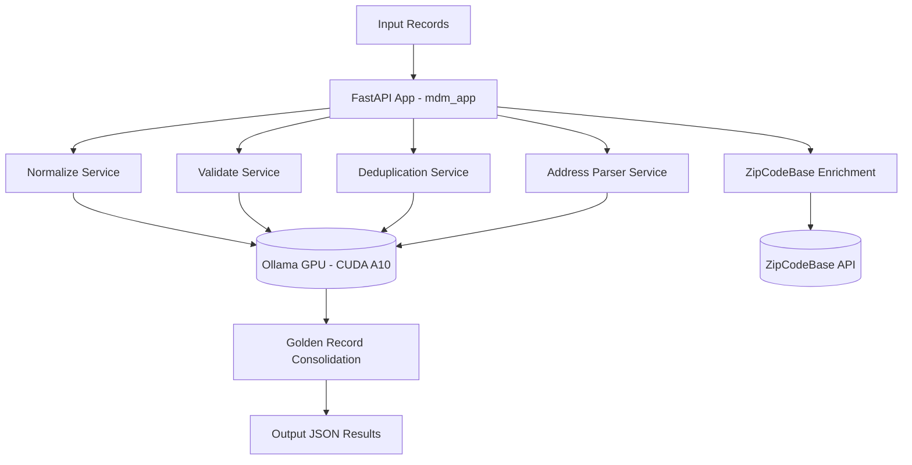

# Master Data Management (MDM) Project Deployment Guide

## 1. Introduction

This project implements a **Master Data Management (MDM) pipeline** powered by **AI agents** and **GPU acceleration**.  
Its purpose is to **normalize, validate, deduplicate, harmonize, and enrich master records** across multiple domains, such as:

- **Customer records** (names, phone numbers, emails, addresses, etc.)  
- **Product data** (SKU, EAN, units, volumes, etc.)  
- **Supplier information** (legal entities, CNPJs, contact data)  
- **Financial data** (transaction codes, normalization rules)  
- **Address standardization** (postal codes, neighborhoods, city/state consistency)

### Example Use Cases
- Consolidating duplicated **customer profiles** coming from multiple systems (CRM, ERP, Mobile App).  
- **Normalizing Brazilian addresses** with CEP validation via **ZipCodeBase API**.  
- Formatting **CPF, CNPJ, and phone numbers** into consistent formats.  
- Enriching records with **external data sources** (postal APIs, product catalogs).  

### Infrastructure
This deployment is designed for **NVIDIA A10 GPU instances** on **Oracle Cloud Infrastructure (OCI)**.  
OCI provides **specialized GPU compute shapes** that are CUDA-enabled, allowing high performance for **large language models (LLMs)** and **parallel inference workloads**.  

The system leverages **CUDA acceleration** to maximize throughput and process large amounts of records efficiently, distributing the workload across multiple GPU endpoints.

---

## 2. Prerequisites

### Hardware
- **GPU**: NVIDIA A10 or higher (OCI `VM.GPU.A10.1` or `BM.GPU.A10.4`).  
- **vCPUs**: Minimum 16 cores.  
- **RAM**: Minimum 64 GB.  
- **Disk**: At least 200 GB SSD (recommended NVMe).  

### Software
- **Operating System**: Oracle Linux 8 or Ubuntu 22.04.  
- **CUDA Toolkit**: Version 12.2+ with NVIDIA drivers installed.  
- **Python**: Version 3.10 or higher.  
- **Ollama**: Serving local LLMs in GGUF format.  
- **Conda Environment**:
  ```bash
  conda create -n mdm python=3.10 -y
  conda activate mdm
  pip install -r requirements.txt
  ```

### Required Python Packages
- `fastapi`  
- `uvicorn`  
- `httpx`  
- `pydantic`  
- `orjson`  
- `rake-nltk`  
- `regex`  
- `numpy`  

### External Services
- **ZipCodeBase API key** for address enrichment.  
- Access to **OCI tenancy** with GPU compute shapes enabled.  

---

## 3. Understand the Architecture

The project follows a **modular architecture** with clear separation of responsibilities.  



### Module Responsibilities
- **FastAPI App**: Orchestrates API requests and workflows.  
- **Normalize Service**: Uses LLM to reformat CPF, CNPJ, phone, and names.  
- **Validate Service**: Ensures compliance with domain-specific rules.  
- **Deduplication Service**: Detects and merges duplicate records.  
- **Address Parser Service**: Extracts structured components (street, city, neighborhood, state).  
- **ZipCodeBase Enrichment**: Complements address data with official postal information.  
- **Golden Record Consolidation**: Produces a unified, conflict-free record.  

---

## 4. Deploy the Application

### Step 1 — Prepare Environment
```bash
git clone https://github.com/your-org/mdm-server.git
cd mdm-server
conda activate mdm
```

### Step 2 — Configure Environment Variables
Create a `.env` file:
```bash
REQUEST_TIMEOUT=300
OLLAMA_ENDPOINTS="http://127.0.0.1:11434,http://127.0.0.1:11435"
NUM_GPU=2000
NUM_BATCH=512
NUM_CTX=8192
NUM_THREAD=512
CONCURRENCY_NORMALIZE=16
CONCURRENCY_ADDRESS=16
ZIPCODEBASE_KEY=your_api_key_here
```

### Step 3 — Launch Ollama GPU Servers
```bash
CUDA_VISIBLE_DEVICES=0 OLLAMA_HOST=127.0.0.1:11434 ollama serve
CUDA_VISIBLE_DEVICES=1 OLLAMA_HOST=127.0.0.1:11435 ollama serve
```

### Step 4 — Run FastAPI Application
```bash
uvicorn mdm_app.app:app --host 0.0.0.0 --port 8080 --workers 4
```

---

## 5. Test

### Send a Test Request
```bash
curl -X POST http://localhost:8080/mdm/process   -H "Content-Type: application/json"   -d '{
        "domain": "customer",
        "operations": ["normalize", "validate", "dedupe", "consolidate"],
        "records": [
          {
            "source": "CRM",
            "id": "cust-1001",
            "name": "Ana Paula",
            "cpf": "98765432100",
            "phone": "21988887777",
            "cep": "22041001",
            "address": "Rua Figueiredo Magalhaes, 123"
          }
        ]
      }'
```

### Expected Output
- **CPF** formatted as `987.654.321-00`.  
- **Phone** formatted as `+55 21 98888-7777`.  
- **CEP** formatted as `22041-001`.  
- **Address enriched** with neighborhood `Copacabana`, city `Rio de Janeiro`, state `RJ`.  
- **Golden record** returned with deduplication applied.  

---

✅ At this point, the project should be fully deployed, running on **OCI A10 GPUs**, and producing clean, standardized, and enriched master data records.  
